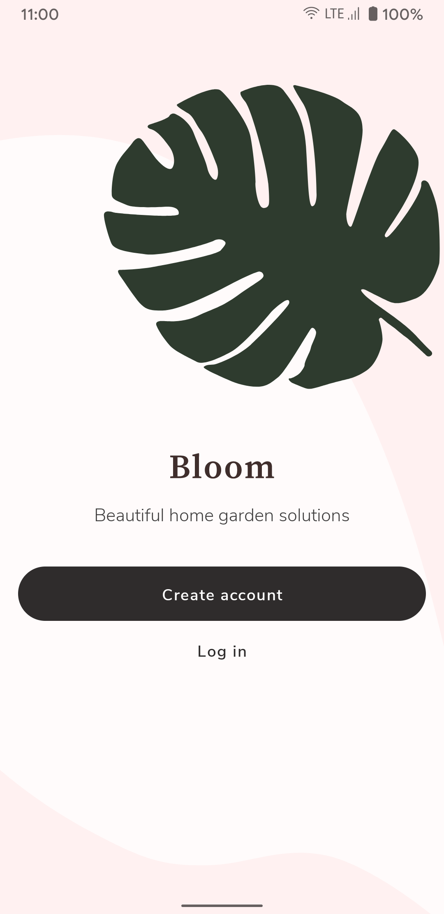
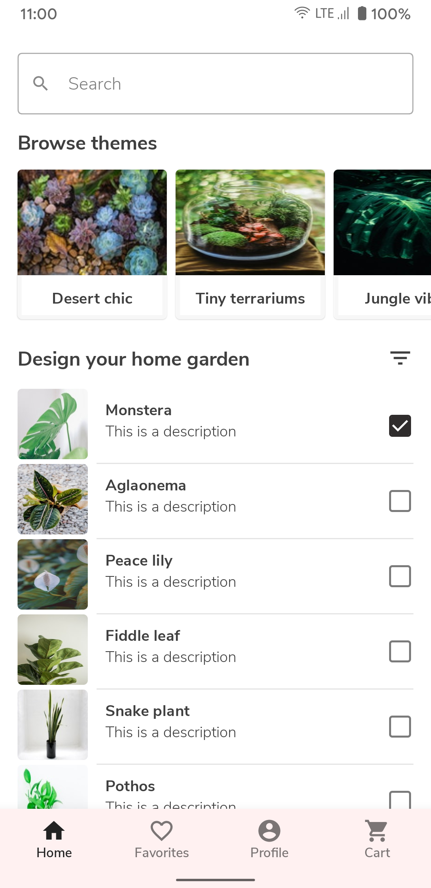
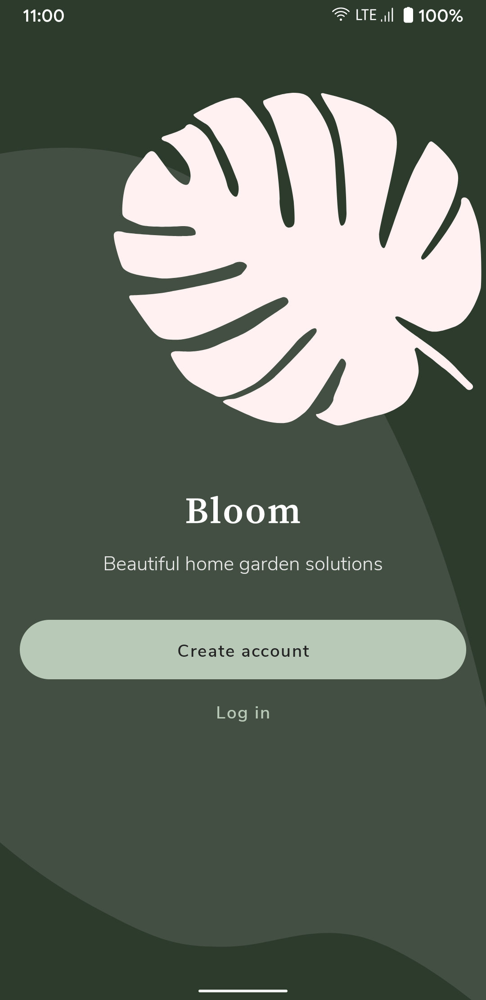
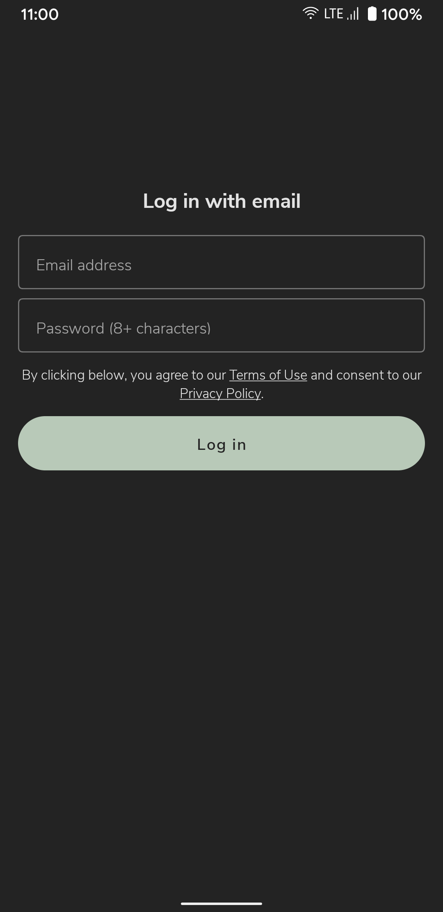
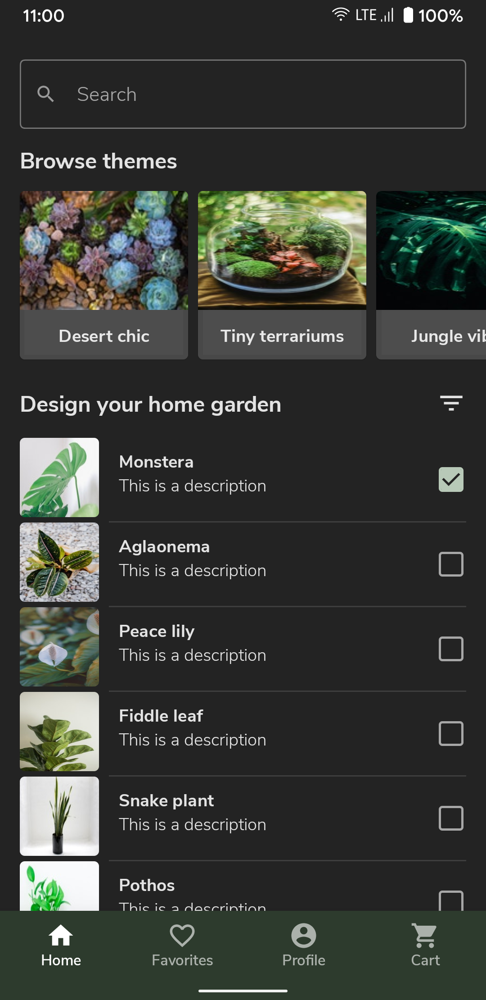

# Speed Run (APAC area) - Week #3

[](https://github.com/opatry/android-dev-challenge-compose-week3-APAC/actions/workflows/Check.yaml)

## :scroll: Description

Implement the _Bloom_ mockup provided for [APAC friendly area](https://github.com/android/android-dev-challenge-compose/blob/assets/Bloom.zip).

## :bulb: Motivation and Context

Apply theming and metrics described in the linked `Bloom.pdf` document.

Few identified issues remains:
- card have their background drawn twice leading to "border" (semi alpha surface colors seems to be applied twice to card background somehow)
- plant list doesn't scroll properly when last item is partially visible (maybe missing padding with bottom nav)
- text fields while focus aren't really nice
- text button color in dark mode might not be correct

## :camera_flash: Screenshots

### 🌞 Light Mode
Welcome | Log in | Home
--- | --- | --- |
 |  | 

### 🌚 Dark Mode
Welcome | Log in | Home
--- | --- | --- |
 |  | 

## License
```
Copyright 2020 The Android Open Source Project

Licensed under the Apache License, Version 2.0 (the "License");
you may not use this file except in compliance with the License.
You may obtain a copy of the License at

    https://www.apache.org/licenses/LICENSE-2.0

Unless required by applicable law or agreed to in writing, software
distributed under the License is distributed on an "AS IS" BASIS,
WITHOUT WARRANTIES OR CONDITIONS OF ANY KIND, either express or implied.
See the License for the specific language governing permissions and
limitations under the License.
```
